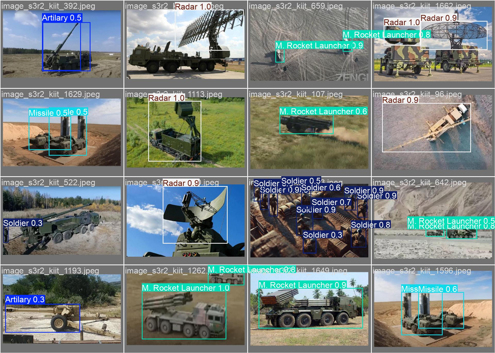

# YOLO26 on KIIT-MiTA Dataset

🚀 **Testing YOLOv26-nano on Military Drone Imagery**

This repository contains the experiments and results of running the newly released **YOLOv26-nano** model on my custom dataset **KIIT-MiTA (KIIT Military Target Archive)**.

---

## 🧪 Experiment Overview

- **Model:** YOLOv26-nano  
- **Dataset:** KIIT-MiTA (1,700 High-Resolution Drone Images)  
- **Classes (7):** Missile, Tank, Radar, Rocket Launcher, Soldier, Vehicle, Artillery  
- **Task:** Real-time Object Detection on Edge  

The goal was to benchmark YOLOv26-nano on challenging aerial defense imagery and validate its performance on small and distant targets.

---

## 📊 Results

- The Nano model is capable of detecting small objects such as soldiers and artillery units with impressive confidence scores.
- Real-time inference was achieved on edge devices, demonstrating efficiency and accuracy.

  
*Figure 1: Example validation batch from KIIT-MiTA dataset (YOLO26nano)*

---

## 🔗 Links

- **Dataset:** (https://kiit-mita.netlify.app/)
- **Code:** (https://www.kaggle.com/code/sudipchakrabarty/yolo26-nano-kiit-mita-dataset-object-detection) 
- **Previous Paper:** (https://ieeexplore.ieee.org/document/10969335) 

---

## 📢 Notes

- This repository is intended for **research and benchmarking purposes**.
- Please cite the dataset and this repository if you use it in your work.
- Contributions and feedback are welcome!

---

